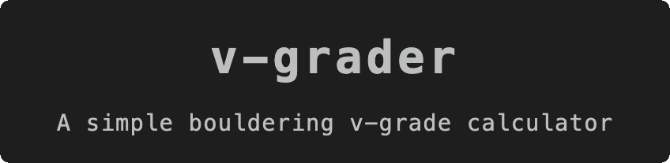

  

## About
The main limitation of the V-grading system is that it is inherently relative rather than objective: grades are assigned by comparing new problems to existing “benchmark” climbs rather than measuring difficulty against any fixed, universal standard. As a result, we run into the conceptual problem of “grade inflation” or an endless ladder of increasing difficulty. Rather than defining new higher grades, the benchmark itself should be reassessed and potentially downgraded.

`v-grader` doesn't claim to solve this problem, but it does provide a simple yet comprehensive grading mechanism that is _close enough_ to being objective.

## Get started
Start by giving each category of your route a rating from 0 to 10. A simple average is then calculated, along with an assigned level where:

$$
\text{level} =
\begin{cases}
\text{soft}, & 0 < x < 0.5 \\
\text{hard}, & 0.5 \le x < 1
\end{cases}
$$

where $x$ is the decimal part of the average.